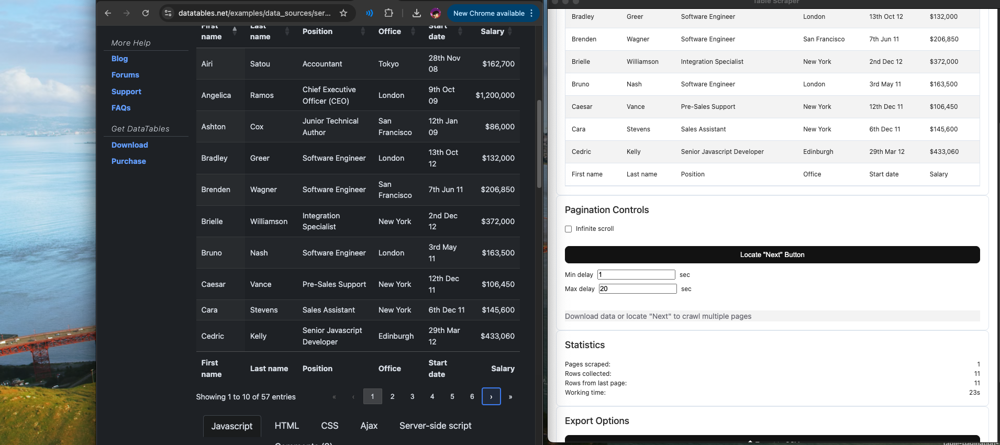

# Table Scraper Chrome Extension

## Project Overview
Table Scraper is a Chrome extension I developed to extract data from HTML tables on web pages. This tool allows users to easily copy tabular data from websites into formats like CSV. I developed this tool because I had issues with web scraping (Primarily issues with proxys and JavaScript Components not loading), and with several use cases, a general web scraping extension that can also paginate and continue on scraping tables continuously is very useful.

## Key Features
- **Table Detection**: Automatically finds all tables on a webpage and allows users to choose which one to extract
- **Data Preview**: Shows a preview of each table before extraction to ensure it's the right data
- **Pagination Support**: Can automatically navigate through multiple pages of a table, collecting data from each page
- **Export Options**: Export data to CSV, with XLSX support planned for future versions
- **Copy to Clipboard**: Quick copy functionality for pasting into spreadsheet applications
- **Statistics Tracking**: Shows progress during multi-page scraping operations

## Technical Implementation
The extension consists of several core components:

1. **Popup Interface**: A simple UI that appears when clicking the extension icon, providing a "Scan for Tables" button
2. **Background Script**: Maintains state between popup and viewer windows
3. **Content Scripts**: Injected into web pages to find and extract table data
4. **Viewer Window**: A dedicated page for displaying extracted data with export options

The extension works by:
1. Injecting a content script to identify all tables on the current page
2. Allowing the user to select which table to extract
3. Using DOM manipulation to extract the table data
4. Providing a dedicated viewer UI for working with the extracted data

### Pagination Detection
One of the most challenging aspects was implementing automatic pagination. Many websites implement "Next" buttons differently, so I created an interactive selector that highlights elements as the user hovers over them, allowing them to manually identify the "Next" button. The extension then stores the CSS selector for that element and can automatically click it when crawling through pages.

View Quick setup and Usage section for more details.

## Technical Stack
- **Languages**: JavaScript, HTML, CSS
- **Browser APIs**: Chrome Extension API, Chrome Storage API, Tabs API
- **Build Tools**: No build system currently, using vanilla JS for maximum compatibility

## Tutorial + How to Set up
- First, begin by cloning this repoand heading to `chrome://extensions/`.
- Toggle developer mode in the top right. 
- Click load unpacked, and select the folder containing this code.
- Now the Chrome extension is loaded on your browser! Will be this way until I put it in the Extensions store.

- Here is a Demo:
    - Navigate to a sample website: `https://datatables.net/examples/data_sources/server_side`
    - Open the Chrome extension menu, and click `Scan Page for Tables`
    - A popup will open, Select the table you desire (in this case its the one with 12 rows)
    - At this point I can copy or export this data if I want, but we can also paginate this data.
    - Click `Locate Next Button`, which should toggle a mode on the webpage that allows us to locate a next button.
    - Select a next button, and a Success Popup should appear.
    - Toggle Infinite Scroll, and leave the default delays as is (they are for if you want to wait for JS rendering)
    - Select `Start Crawling`, you can see the program select the next page and capture the contents of the table
    - Once finished, we can export this data.

## Screenshots

*The screenshot shows the Table Scraper extension in action. On the left side, you can see a sample DataTables website with a pagination table. The blue highlight showcases the next button locator, in which we click to tell the program what to click to go next. On the right side is the Table Scraper interface showing the extracted data, pagination controls, statistics, and export options.*

